## MERN STACK IMPLEMENTATION

### BACKEND CONFIGURATION
### To Update ubuntu
`sudo apt update`

### To Upgrade ubuntu
`sudo apt upgrade`
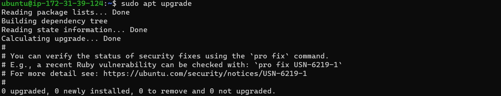

### To get the location of Node.js software from Ubuntu repositories
`curl -fsSL https://deb.nodesource.com/setup_18.x | sudo -E bash -`

### To install Node.js on the server
`sudo apt-get install -y nodejs`
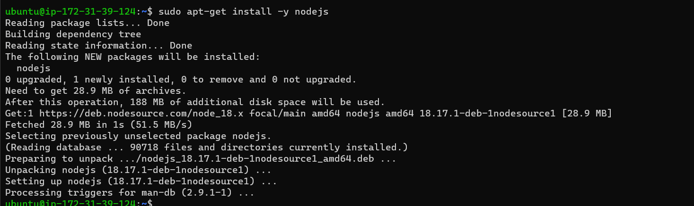

### To verify installation of nodejs and npm
`node -v`
`npm -v`
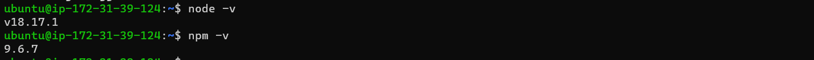

### Application Code Setup
### To create a new directory for To-Do project and verify
`mkdir Todo`
`ls`
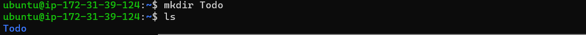

### To change directory to Todo and initialize project Todo
`cd Todo`

`npm init`

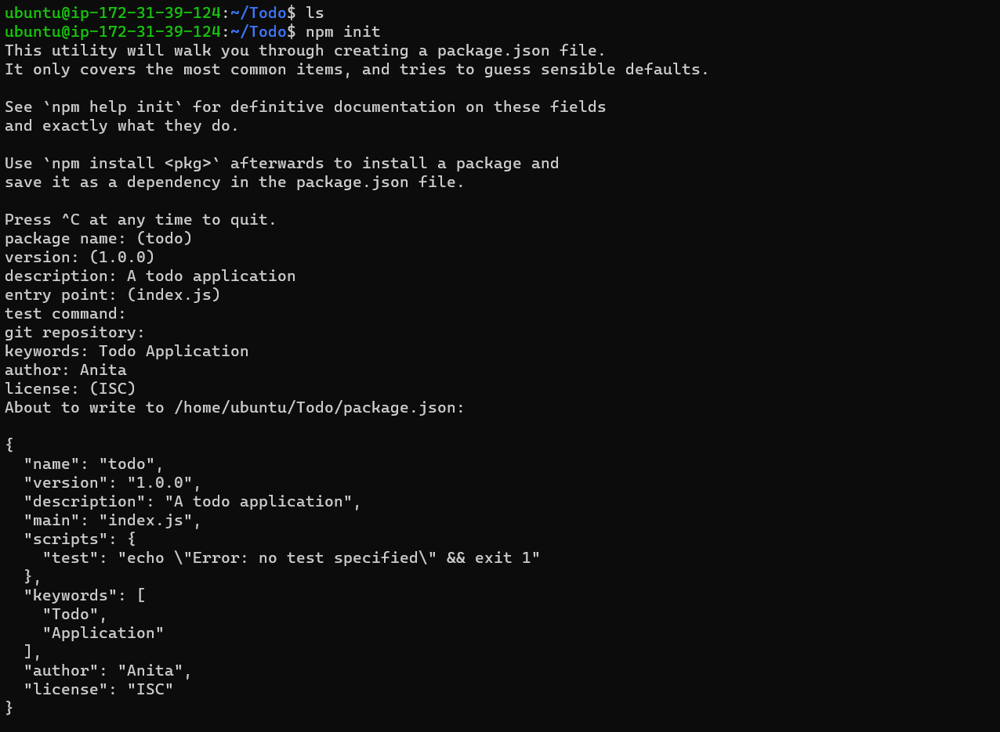
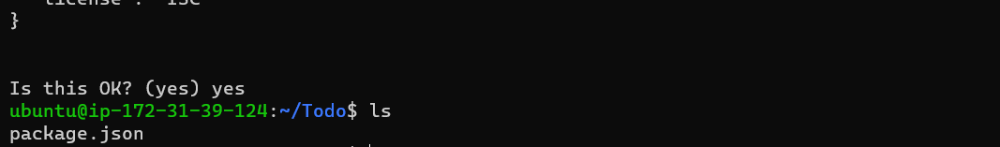

# To Install ExpressJS
## To install Express using npm
`npm install express`
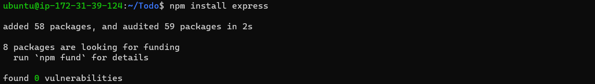

## To create file index.js and confirm creation
`touch index.js`
`ls`
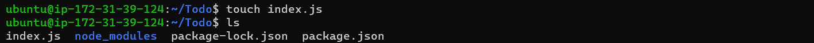

## To install the dotenv module
`npm install dotenv`
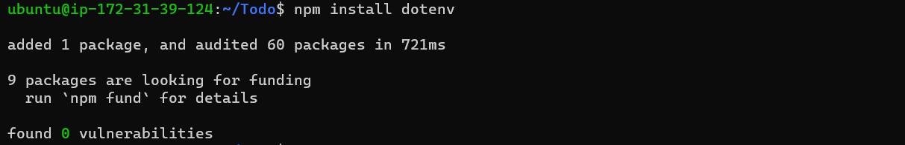

## To open the index.js file, copy code into it and save
`vim index.js`
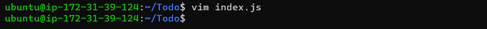

## To start our server
`node index.js`

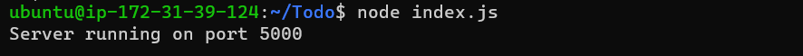

## Routes
*To create a folder routes, create a file in it and write a command in the file*
`mkdir routes`
`cd routes`
`touch api.js`
`vi api.js`

## MODELS

*A model needs ti be created in order for the application to use Mongodb. The model also defines the database schema. A schema is the blueprint of how the database will be constructed*
*Mongoose has to be installed to create Schema and a model*

### Change directory back Todo folder with cd .. and install Mongoose
`npm install mongoose`
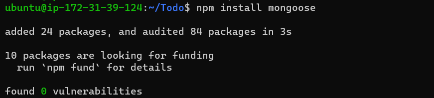

### Create a new folder models
`mkdir models`

### Change directory into the newly created ‘models’ folder
`cd models`

### Inside the models folder, create a file and name it todo.js
`touch todo.js`

### Alernatively, combine the 3 codes above as below

`mkdir models && cd models && touch todo.js`

### Next open the file created with vim todo.js then paste the code below in the file:

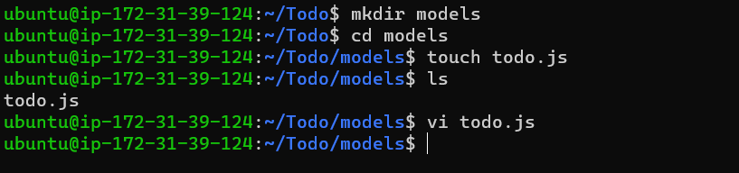

### The image below is the final product
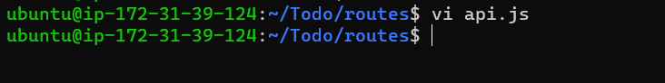

## To update our routes from the file api.js in ‘routes’ directory to make use of the new model
## In Routes directory, open api.js with vim api.js, delete the code inside with :%d command and paste there code below into it then save and exit with :wqa!

`vim api.js`

`:%d`

`wqa!`
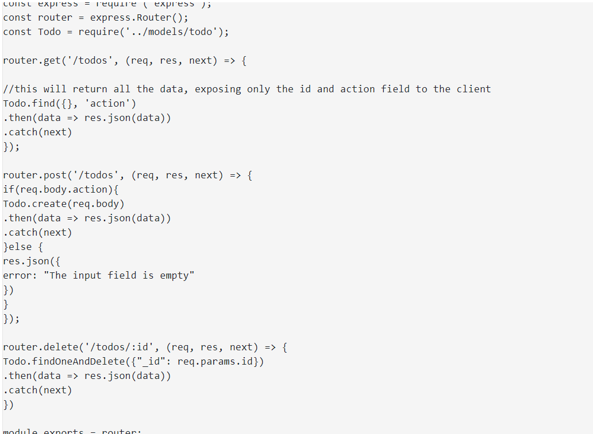

## MONGODB DATABASE
*Using mLab to store data. mLab provides MongoDB database as a service solution (DBaaS), to sign up for a shared clusters free account,  Sign up herewith link below. Follow the sign up process, select AWS as the cloud provider, and choose a region near you.*

[Mongodb signup](https://www.mongodb.com/atlas-signup-from-mlab)

- Allow access to the MongoDB database from anywhere (Not secure, but it is ideal for testing)

- In the image below, make sure you change the time of deleting the entry from 6 Hours to 1 Week

- In the index.js file, we specified process.env to access environment variables

*Create a file in your Todo directory and name it .env.*

`Touch .env`

*Open the file*

`vi .env`

*Add the connection to access the databade in it and edit username, password, network address and database.*

*To get the connection string*

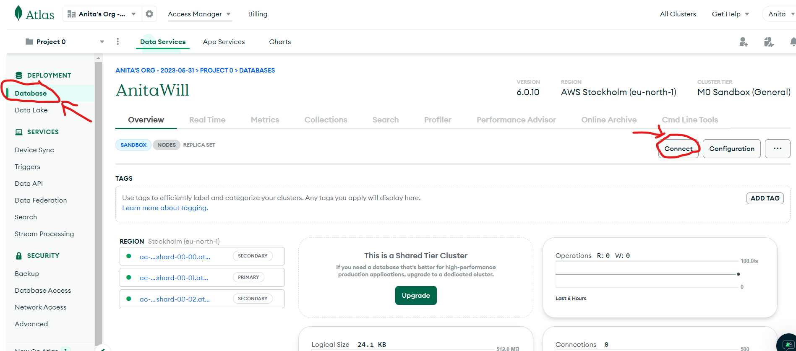
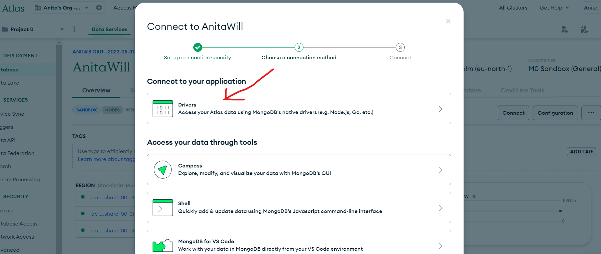
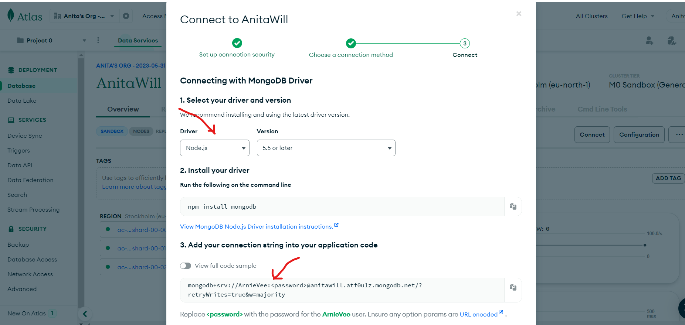

*For Node.js to connect to database, we need to update the index.js to reflect the use of .env*
*Simply delete existing content in the file, and update it following the steps below*

`vim index.js`
`esc`
`:%d` 
*Press enter*

- The entire content will be deleted, then,

- Press i to enter the insert mode in vim

- Now, paste the entire code below in the file.

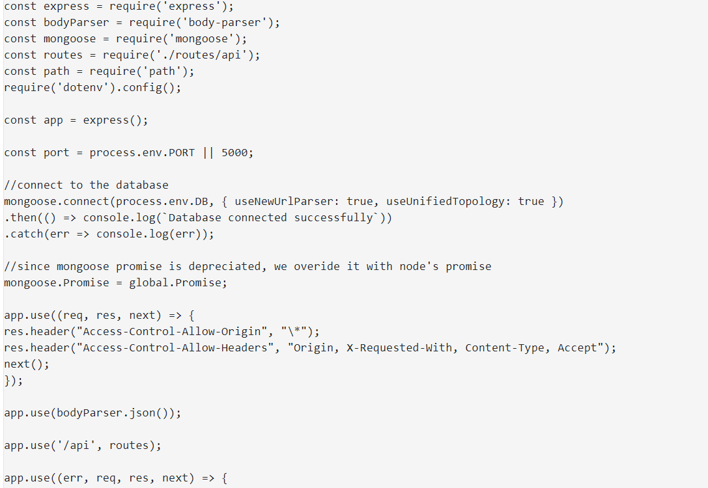
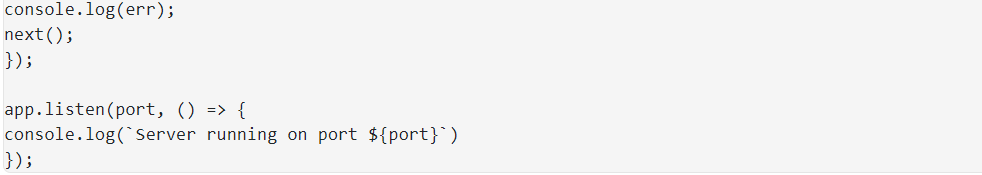

*Start your server using the command*

`node index.js`

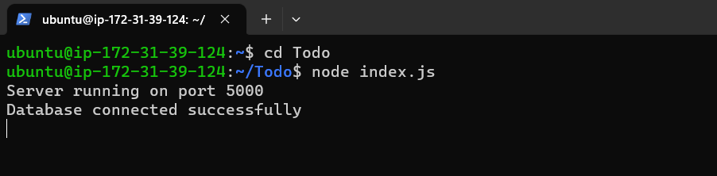

### Testing Backend Code without Frontend using RESTful API

- In this project, we will use Postman to test our API.

[To Install POSTMAN](https://www.postman.com/downloads/)

-You should test all the API endpoints and make sure they are working. For the endpoints that require body, you should send JSON back with the necessary fields since it’s what we setup in our code.

- Open Postman

- create a POST request to the API 
http://<PublicIP-or-PublicDNS>:5000/api/todos. 

*This request sends a new task to our To-Do list so the application could store it in the database.*

*Note: make sure your set header key Content-Type as application/json as below*

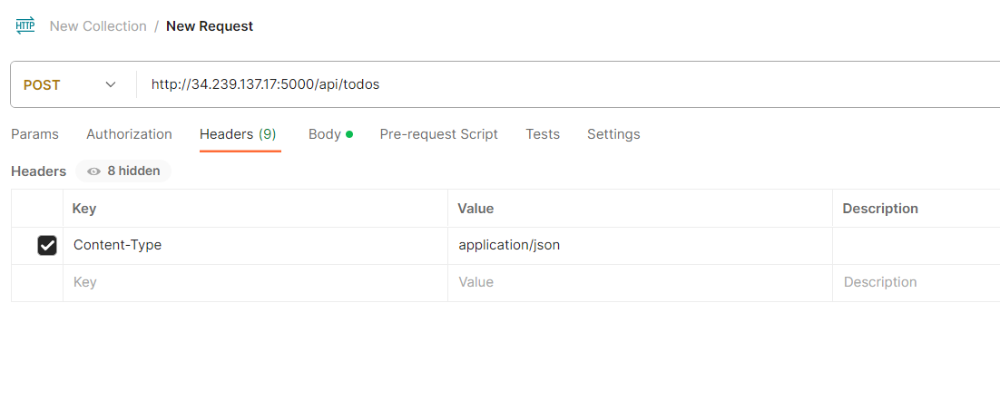
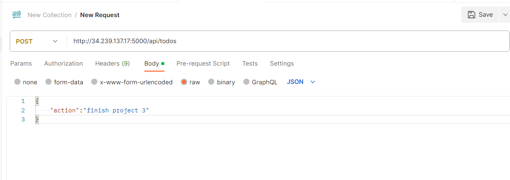

*The GET request retrieves all existing records from out To-do application.*

*To create a GET request to your API on http://<PublicIP-or-PublicDNS>:5000/api/todos, select "GET" and send*

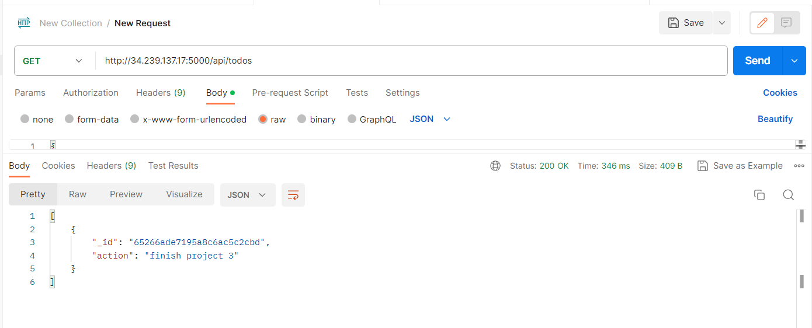

## FRONTEND CREATION
*To start out with the frontend of the To-do app, we will use the create-react-app command to scaffold our app. This will create a new folder in the Todo directory called client, where all the react code will be added.*

-Run the code below in the Todo directory

` npx create-react-app client`

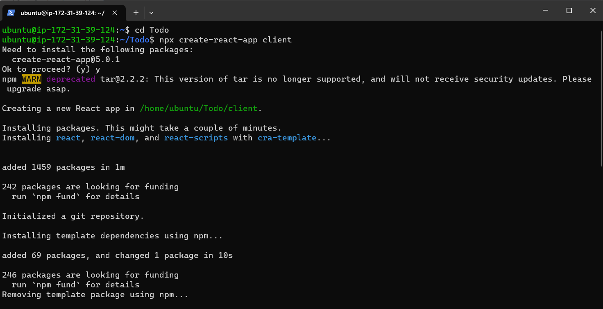
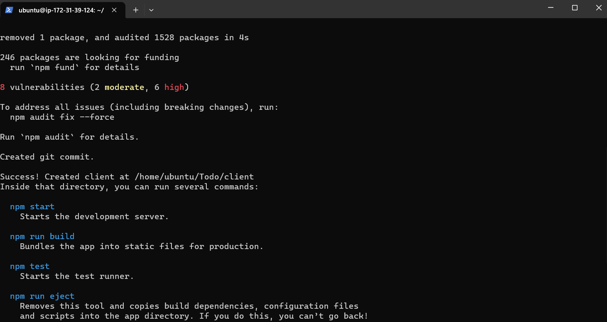
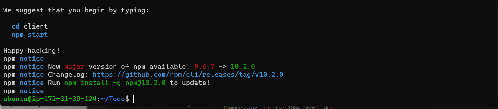

### Running a React App
*Some dependencies need to be installed first.*

1. Install concurrently- It is used to run more than one command simultaneously from the same terminal window.

`npm install concurrently --save-dev`
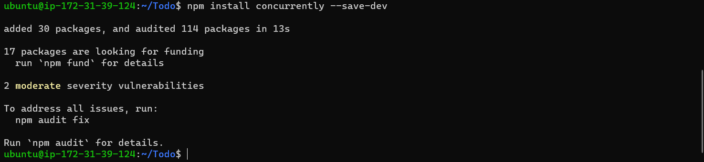

2. Install nodemon. It is used to run and monitor the server. If there is any change in the server code, nodemon will restart it automatically and load the new changes.

`npm install nodemon --save-dev`
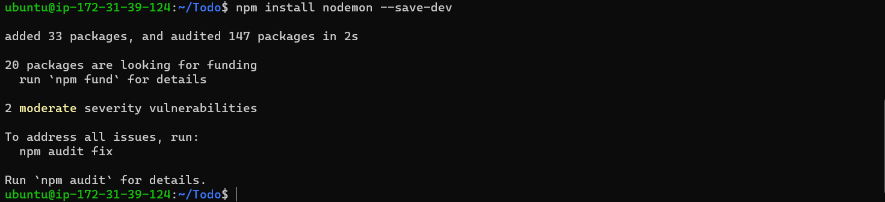

3. In Todo folder open the package.json file. Change the highlighted part of the below screenshot and replace with the code below.

`"scripts": {
"start": "node index.js",
"start-watch": "nodemon index.js",
"dev": "concurrently \"npm run start-watch\" \"cd client && npm start\""
},`

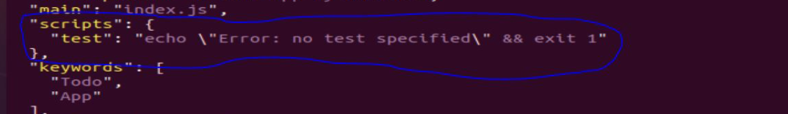
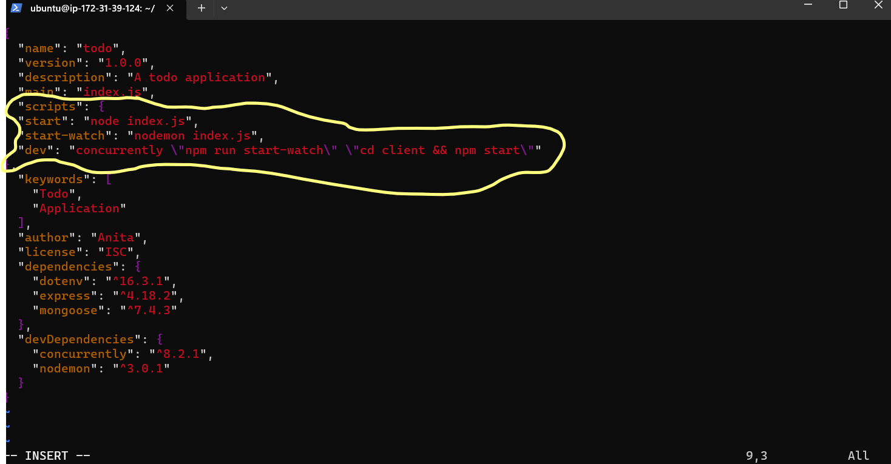

### Configure Proxy in package.json
- Change directory to client

`cd Client`

- Open the package.json file

`vi package.json`

- Add the key value pair in the package.json file "proxy": "http://localhost:5000".

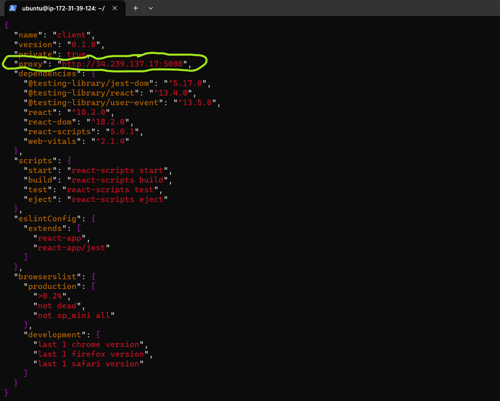

- Go back to Todo directory and run the command below, the app should open and start running on localhost:3000

`apm run dev`
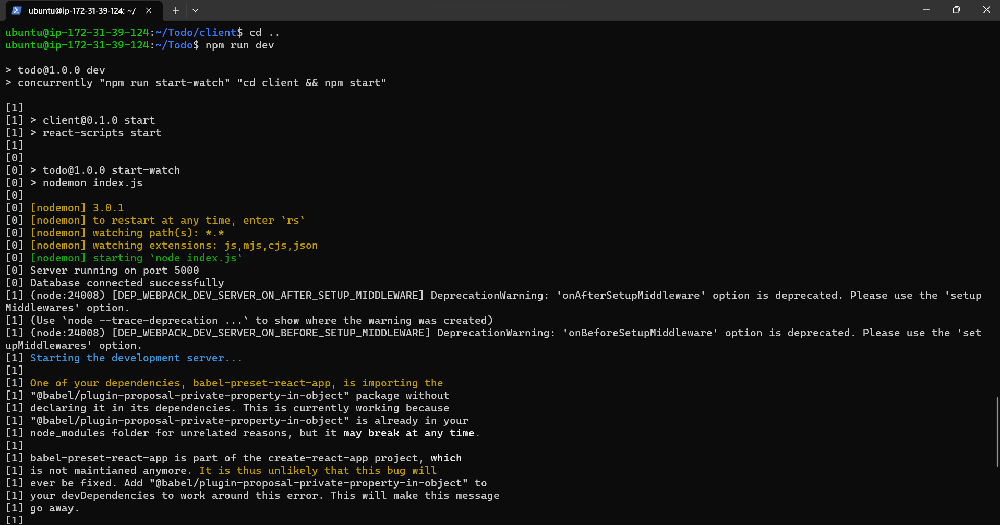
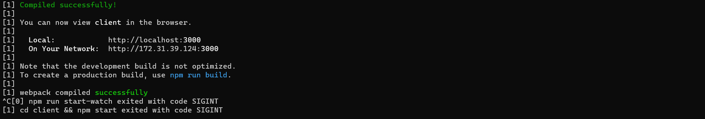

*Running the app on localhost:3000

- Note: In order to be able to access the application from the Internet, open TCP port 3000 on EC2 by adding a new Security Group rule.

[App on Localhost:3000](http://34.239.137.17:3000/)
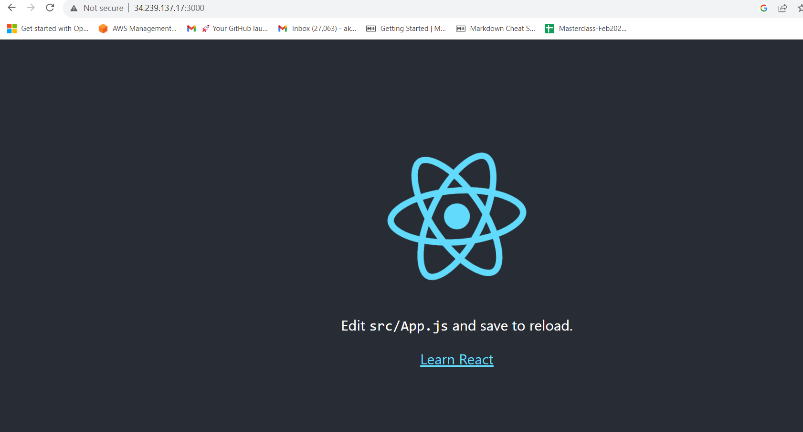

### Creating your React Components

*From your Todo directory run*

`cd client`

*move to the src directory*

`cd src`

*Create a folder called components in the src*

`mkdir components`

*Move into the components directory with the command below*

`cd components`

*Inside ‘components’ directory create three files Input.js, ListTodo.js and Todo.js.*

`Touch input.js ListTodo.js Todo.js`

*Open Input.js file*

`vi Input.js`
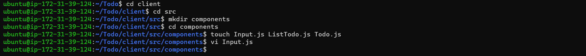

*replace code with the one below*
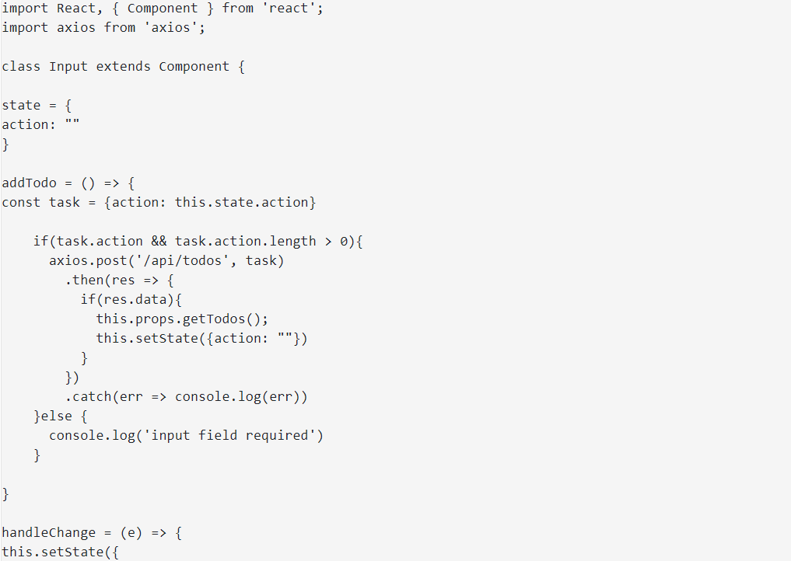
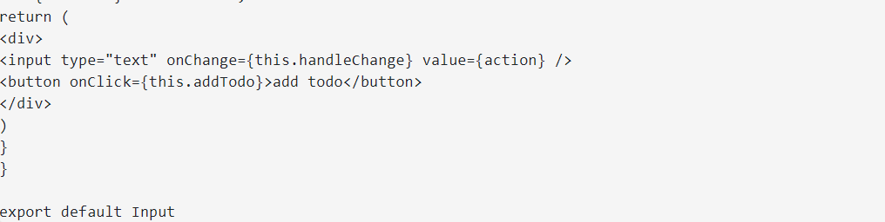

*Next Axios is installed, which is a Promise based HTTP client for the browser and node.js. This is done in the client folder. The command below is used to change directory to client folder*

`cd ../..`

*To install Axious*

`npm install Axios`

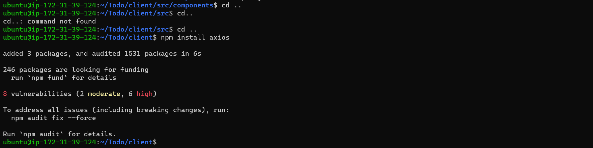

