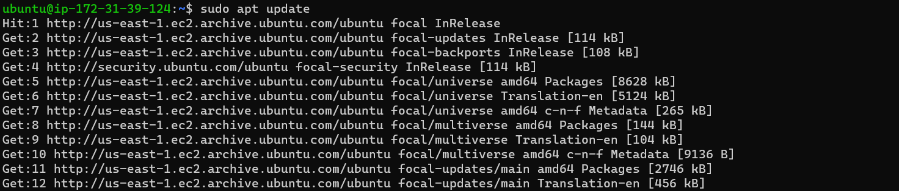
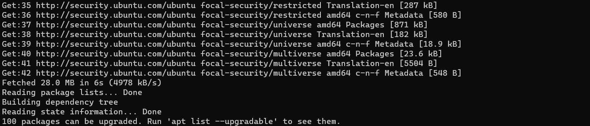
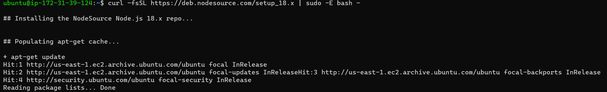
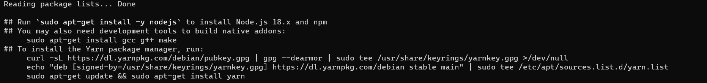
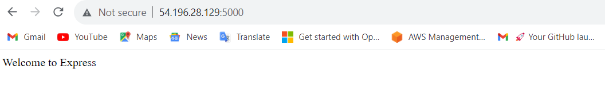
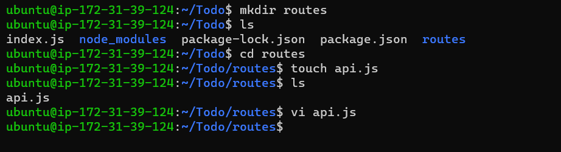

## MERN STACK IMPLEMENTATION

### BACKEND CONFIGURATION
### To Update ubuntu
`sudo apt update`

### To Upgrade ubuntu
`sudo apt upgrade`

### To get the location of Node.js software from Ubuntu repositories
`curl -fsSL https://deb.nodesource.com/setup_18.x | sudo -E bash -`

### To install Node.js on the server
`sudo apt-get install -y nodejs`

### To verify installation of nodejs and npm
`node -v`
`npm -v`

### Application Code Setup
### To create a new directory for To-Do project and verify
`mkdir Todo`
`ls`

### To change directory to Todo and initialize project Todo
`cd Todo`
`npm init`

# To Install ExpressJS
## To install Express using npm
`npm install express`

## To create file index.js and confirm creation
`touch index.js`
`ls`

## To install the dotenv module
`npm install dotenv`

## To open the index.js file, copy code into it and save
`vim index.js`

## To start our server
`node index.js`

## Routes
*To create a folder routes, create a file in it and write a command in the file*
`mkdir routes`
`cd routes`
`touch api.js`
`vi api.js`

## MONGODB DATABASE
