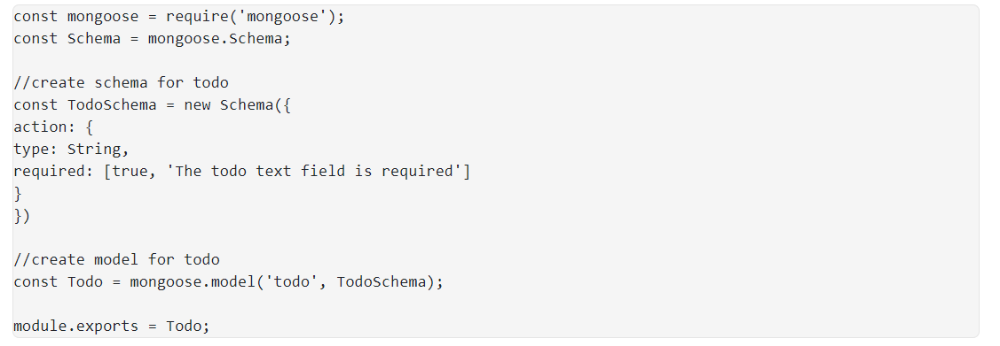

## MERN STACK IMPLEMENTATION

### BACKEND CONFIGURATION
### To Update ubuntu
`sudo apt update`

### To Upgrade ubuntu
`sudo apt upgrade`

### To get the location of Node.js software from Ubuntu repositories
`curl -fsSL https://deb.nodesource.com/setup_18.x | sudo -E bash -`

### To install Node.js on the server
`sudo apt-get install -y nodejs`

### To verify installation of nodejs and npm
`node -v`
`npm -v`

### Application Code Setup
### To create a new directory for To-Do project and verify
`mkdir Todo`
`ls`

### To change directory to Todo and initialize project Todo
`cd Todo`

`npm init`

# To Install ExpressJS
## To install Express using npm
`npm install express`

## To create file index.js and confirm creation
`touch index.js`
`ls`

## To install the dotenv module
`npm install dotenv`

## To open the index.js file, copy code into it and save
`vim index.js`

## To start our server
`node index.js`

## Routes
*To create a folder routes, create a file in it and write a command in the file*
`mkdir routes`
`cd routes`
`touch api.js`
`vi api.js`

## MODELS

*A model needs ti be created in order for the application to use Mongodb. The model also defines the database schema. A schema is the blueprint of how the database will be constructed*
*Mongoose has to be installed to create Schema and a model*

### Change directory back Todo folder with cd .. and install Mongoose
`npm install mongoose`

### Create a new folder models
`mkdir models`

### Change directory into the newly created ‘models’ folder
`cd models`

### Inside the models folder, create a file and name it todo.js
`touch todo.js`

### Alernatively, combine the 3 codes above as below

`mkdir models && cd models && touch todo.js`

### Next open the file created with vim todo.js then paste the code below in the file:

### The image below is the final product

## To update our routes from the file api.js in ‘routes’ directory to make use of the new model
## In Routes directory, open api.js with vim api.js, delete the code inside with :%d command and paste there code below into it then save and exit with :wqa!

`vim api.js`

`:%d`

`wqa!`

## MONGODB DATABASE
*Using mLab to store data. mLab provides MongoDB database as a service solution (DBaaS), to sign up for a shared clusters free account,  Sign up herewith link below. Follow the sign up process, select AWS as the cloud provider, and choose a region near you.*

[Mongodb signup](https://www.mongodb.com/atlas-signup-from-mlab)

-Allow access to the MongoDB database from anywhere (Not secure, but it is ideal for testing)

-In the image below, make sure you change the time of deleting the entry from 6 Hours to 1 Week

-In the index.js file, we specified process.env to access environment variables

*Create a file in your Todo directory and name it .env.*

`Touch .env`

*Open the file*

`vi .env`

*Add the connection to access the databade in it and edit username, password, network address and database.*

*To get the connection string*

*For Node.js to connect to database, we need to update the index.js to reflect the use of .env*
*Simply delete existing content in the file, and update it following the steps below*

`vim index.js`
`esc`
`:%d` 
*Press enter*

-The entire content will be deleted, then,

-Press i to enter the insert mode in vim

-Now, paste the entire code below in the file.

